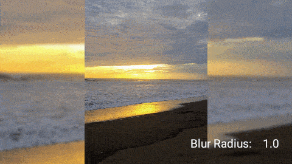

# BbImageView
`BbImageView` is a custom `ImageView` for Android that simplifies displaying a blurred background when images do not cover the entire drawing area.


## Download
You can download an aar file from GitHub's [releases page][1].

Or use Gradle:
```gradle
dependencies {
  implementation 'com.cjespinozani:bbimageview:1.1.0'
}
```

## How do I use BbImageView?
The same way you use an `ImageView`. Place the view in your XML layout file.
```xml
  <com.cjespinozani.widget.BbImageView
    android:id="@+id/imageView"
    android:layout_width="match_parent"
    android:layout_height="match_parent"
    android:src="@drawable/some_drawable"
  />
```

Then you can reference it in code
```kotlin
  val view: BbImageView = findViewById(R.id.imageView)
```


## Attributes
Aditional attributes can be set in code.
```kotlin
  view.showBlurredBackground = true   //showBlurredBackground: Boolean. Whether to show a blurred background.
  view.hideMainImage = false          //hideMainImage: Boolean. Whether to hide the main image.
  view.blurRadius = 12f               //blurRadius: Float. Blur radius to apply, must be > 0 <= 25
```

As well as in the layout file.
```xml
  app:showBlurredBackground="true"
  app:hideMainImage="false"
  app:blurRadius="12"
```


## Preview



# BbImageViewSwitcher
This library also includes `BbImageViewSwitcher`, a custom `ViewSwitcher` that display images using `BbImageView`. The main purpose of this view is to show transition effects berween image changes. Note that this view uses twice as many resources to show the transition effect, use it wisely.

## How to use BbImageViewSwitcher?
Place the view in your XML layout file. Notice that this view requires `app:src` attribute instead of `android:src`
```xml
  <com.cjespinoza.widget.BbImageViewSwitcher
    android:id="@+id/imageViewSwitcher"
    android:layout_width="match_parent"
    android:layout_height="match_parent"
    android:inAnimation="@android:anim/fade_in"
    android:outAnimation="@android:anim/fade_out"
    app:src="@drawable/some_drawable"
  />
```

You can reference it in code
```kotlin
  val imageViewSwitcher: BbImageViewSwitcher = findViewById(R.id.imageViewSwitcher)
```

and change it's drawable when necessary
```kotlin
  imageViewSwitcher.setImageDrawable(someDrawable)

  //or
  imageViewSwitcher.setImageBitmap(someBitmap)

  //or
  imageViewSwitcher.setImageSrc(someDrawableId)

  //or
  imageViewSwitcher.setImageURI(someDrawableUri) //from a local Uri only
```


## Attributes
Aditional attributes can be set in code.
```kotlin
  imageViewSwitcher.showBlurredBackground = true   //showBlurredBackground: Boolean. Whether to show a blurred background.
  imageViewSwitcher.hideMainImage = false          //hideMainImage: Boolean. Whether to hide the main image.
  imageViewSwitcher.blurRadius = 12f               //blurRadius: Float. Blur radius to apply, must be > 0 <= 25
```

As well as in the layout file.
```xml
  app:showBlurredBackground="true"
  app:hideMainImage="false"
  app:blurRadius="12"                 
```


## Preview


# Compatibility
Requires API 17+


# License
```
Copyright (C) 2020 Carlos Joel Espinoza Perez

Licensed under the Apache License, Version 2.0 (the "License");
you may not use this file except in compliance with the License.
You may obtain a copy of the License at

  http://www.apache.org/licenses/LICENSE-2.0

Unless required by applicable law or agreed to in writing, software
distributed under the License is distributed on an "AS IS" BASIS,
WITHOUT WARRANTIES OR CONDITIONS OF ANY KIND, either express or implied.
See the License for the specific language governing permissions and
limitations under the License.
```

[1]: https://github.com/cjespinoza-ni/BbImageView/releases